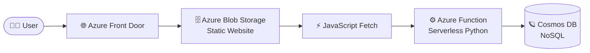

# ☁️ Azure Cloud Resume Challenge

Hey there! 👋 Welcome to the repository for my **Azure Cloud Resume Challenge**. 

This project isn't just a digital version of my resume—it's a full-stack, cloud-native application built from scratch to demonstrate my skills in Cloud Engineering, DevOps, and Serverless Architecture on Microsoft Azure.

Check out the live site here: cloudresume-aidan-amh2fchwhxdbcde5.z02.azurefd.net 

---

## 🏗️ Architecture Overview

Here is a high-level look at how the different cloud services interact:



### The Stack
* **Frontend:** Semantic HTML5, Vanilla CSS3, Vanilla JavaScript.
* **Storage:** Azure Blob Storage (Static Website Hosting).
* **Delivery:** Azure Front Door (Global Edge CDN, HTTPS, Caching).
* **Backend API:** Azure Functions (Python V2 Programming Model, Serverless Consumption Plan).
* **Database:** Azure Cosmos DB (Serverless, NoSQL).
* **Infrastructure as Code (IaC):** Terraform.
* **CI/CD:** GitHub Actions.
* **Monitoring:** Azure Application Insights.

---

## 🚀 The Journey

Building this architecture was broken down into logical phases, ensuring every layer was rock-solid before moving to the next.

### 1. Frontend & Static Hosting
I built a clean, responsive resume using HTML and CSS. Instead of paying for a traditional web server, I deployed the assets to an **Azure Blob Storage** account configured for static website hosting. To ensure the site was fast globally and secured with HTTPS, I routed traffic through **Azure Front Door**.

### 2. The Serverless API (Backend)
To track how many people visit my resume, I wrote a serverless HTTP-triggered API using **Python**. The API connects to an **Azure Cosmos DB** instance to read the current visitor count, increments it, saves the new value, and returns it to the frontend.

### 3. Automated Testing
Before automating deployments, I wrote a test suite using `pytest`. I utilized `unittest.mock` to mock the Cosmos DB client, allowing me to rigorously test the API logic in isolation without making real database calls. 

### 4. Infrastructure as Code (IaC)
ClickOps is a thing of the past. I codified my backend infrastructure using **Terraform**. My `main.tf` file provisions the Resource Group, Storage Account, Application Insights, Cosmos DB account, and the Azure Function App. By defining the infrastructure in HCL, the environment is 100% reproducible and self-documenting.

### 5. CI/CD Pipelines
I built two separate **GitHub Actions** workflows to automate deployments based on the principle of least privilege:
* **Frontend Pipeline:** Triggers only when `frontend/` files change. Uses a Service Principal to log into Azure CLI and upload static assets directly to Blob Storage.
* **Backend Pipeline:** Triggers only when `backend/` files change. It provisions an Ubuntu runner, installs Python dependencies directly into a `.python_packages` directory, runs the `pytest` suite, and if tests pass, zips the code and deploys it to Azure Functions using a Publish Profile.

---

## 🐛 The Hardest Bugs I Squashed

No cloud project is complete without some intense debugging sessions. Here are a few things I learned the hard way:

* **The Kudu Deployment Catch-22:** When deploying a Python Azure Function via GitHub Actions, the action natively overrides remote builds on the server. I solved this by explicitly pre-building the `.python_packages` directory on the GitHub runner before Zipping the deployment package.
* **Atomic Deployments:** To prevent the Azure Function from returning a `404 Not Found` during deployment swaps, I configured the app setting `WEBSITE_RUN_FROM_PACKAGE = "1"` in Terraform, forcing Azure to mount the zip file directly as a read-only filesystem.
* **CDN Caching:** Azure Front Door caches edge content heavily. When my CI/CD pipeline successfully pushed new CSS styles, the website didn't update! I learned how to track the deployment directly to Blob Storage and manually purge the CDN edge cache.

---

## 🛠️ How to run locally

If you want to spin this up on your local machine:

1. Clone the repository.
2. Ensure you have the [Azure Functions Core Tools](https://learn.microsoft.com/en-us/azure/azure-functions/functions-run-local) and Python 3.11+ installed.
3. CD into `backend/function_app` and create a virtual environment:
   ```bash
   python -m venv .venv
   source .venv/bin/activate  # On Windows: .\.venv\Scripts\activate
   pip install -r requirements.txt
   ```
4. Create a `local.settings.json` file in `backend/function_app` and provide your Cosmos DB connection string.
5. Run `func start` to spin up the local API.
6. Open `frontend/index.html` in your browser!

---
*This project was completed as part of the Cloud Resume Challenge.*
